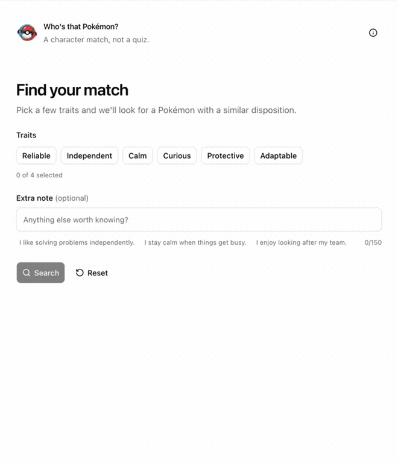
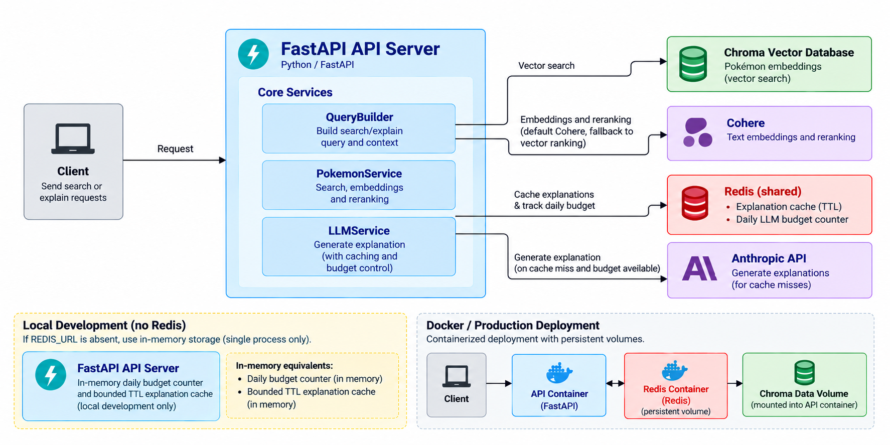

<p align="center">
  
</p>

# Who's That Pokémon?

Find a Pokémon that fits your personality. Choose traits such as **calm** or
**curious**, add an optional note, and explore five ranked matches. Open a result
to get a short explanation of why it fits.



## Why I built it

As Pokémon celebrates its 30th anniversary, choosing a companion from more than 1,000 creatures can feel overwhelming. I built Pokémon Match Maker to make that choice more personal: select up to four traits, add an optional note, and get five ranked matches. The app uses semantic search to find them and an LLM to explain why each one might fit.

## How it works

```text
Traits + optional note
  → query builder → Cohere embedding → Chroma candidate search
  → Cohere reranking (25 candidates → 5 results)
  → optional explanation from Anthropic, cached in Redis
```

The UI is a Next.js app. Its server actions call a FastAPI service, so provider
keys stay on the server. The API uses Redis for shared explanation caching and a
daily limit on paid explanation requests. If reranking is temporarily unavailable,
search still returns the original vector ranking.



## What I measured

On a 50-query, project-specific evaluation set, reranking 25 candidates improved
Recall@5 from **0.76 to 0.90** and nDCG@5 from **0.46 to 0.62**, while median
request latency rose from **0.32 s to 0.74 s**. These are measurements of this
evaluation set, not a claim about every possible query. The cases, labeling
scheme, method, and other results are in the [evaluation README](evaluation/README.md).

## Run it locally

You need Python 3.13+, [uv](https://docs.astral.sh/uv/), Docker with Compose, and
Cohere and Anthropic API keys. Building the search index calls Cohere and may
incur provider charges.

1. Create `.env` from the example and add your provider keys:

   ```sh
   cp .env.example .env
   # Set ANTHROPIC_API_KEY and COHERE_API_KEY in .env.
   ```

2. Generate the Chroma index. It lives in `data/chroma` and is not committed to Git:

   ```sh
   make install
   make pipeline
   ```

3. Start the website, API, and Redis:

   ```sh
   docker compose up --build
   ```

Open **http://localhost:3000** for the website. The API documentation is at
**http://localhost:8000/docs**. The API's `/ready` endpoint checks that the
search index is available without calling a paid provider.

For API-only development, run `make server`. For client development outside
Docker, install [Bun](https://bun.sh/), run `cd client && bun install`, then use
`make dev` from the repository root. See the [client README](client/README.md)
and [server README](server/README.md) for implementation details.

## Configuration and deployment

- Keep `.env` and provider keys out of Git. See [.env.example](.env.example) for
  the main settings.
- Set `TRUSTED_HOSTS` for the hosts that reach FastAPI. Set `ALLOWED_ORIGINS` if
  browsers call the API directly; the included Next.js app calls it server-side.
- Set `LLM_ENABLED=false` to turn off paid explanations while keeping search
  available. `EXPLAIN_DAILY_LLM_BUDGET` limits paid explanation cache misses.
- Persist `data/chroma` and Redis data in a hosted deployment. The embedded
  Chroma index is designed here for one API instance.

## Development and tests

```sh
make test                         # Python tests
make lint                         # Python and client lint checks
make evaluate EVAL_ARGS="--strategies raw,rerank"
```

GitHub Actions runs tests, builds the Next.js client, and builds both deployment
images. The [evaluation README](evaluation/README.md) explains the retrieval
experiments; the [client README](client/README.md) explains the UI boundaries;
and the [server README](server/README.md) covers the API and runtime settings.

## Credits and license

Pokémon data comes from [PokéAPI](https://pokeapi.co/), created by Paul Hallett
and its contributors. Pokémon sprites are served from the
[PokéAPI sprites repository](https://github.com/PokeAPI/sprites). Pokémon names,
characters, and artwork belong to their respective rights holders, including
The Pokémon Company. This is an independent fan project and is not affiliated
with or endorsed by PokéAPI, Nintendo, Game Freak, or The Pokémon Company.

The original code and documentation in this repository are available under the
[MIT License](LICENSE). That license does not grant rights to third-party
Pokémon data, sprites, or other artwork.
